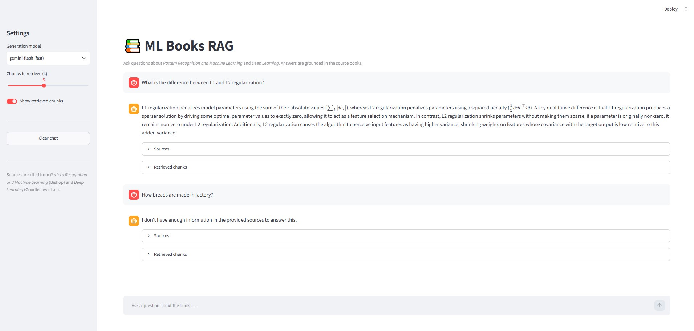

# RAG System for Machine Learning Books

Retrieval-Augmented Generation (RAG) system for Machine Learning textbooks. This pipeline ingests PDFs, processes text and images, generates embeddings, and performs retrieval and generation to answer complex ML queries based on the ingested literature. The system currently processes 2 comprehensive Machine Learning books ("Deep Learning" by Ian Goodfellow, and "Pattern Recognition and Machine Learning" by Christopher Bishop).

> 📖 **Documentation:** For an in-depth look at the system architecture, data flow, and pipeline stages, please review our [Detailed Architecture Documentation](docs/architecture/README.md).

## 🖥️ Interface



## Dataset

The current dataset consists of the following books:
- **Deep Learning** by Ian Goodfellow, Yoshua Bengio, and Aaron Courville
- **Pattern Recognition and Machine Learning** by Christopher M. Bishop

## 📁 Structure

```text
rag_ml_books/
├── app/
│   └── streamlit_app.py
├── data/
│   ├── raw/
│   │   ├── pdfs/                     # Input PDFs
│   │   ├── images/                   # Extracted images
│   │   └── metadata/books_metadata.json
│   ├── processed/
│   │   ├── chunks/
│   │   │   ├── documents_v1.json     # Pages
│   │   │   ├── chunks_v1.jsonl       # Chunks (JSONL)
│   │   │   └── chunks_v1.parquet     # Chunks (Parquet)
│   │   ├── embeddings/embeddings_v1.parquet
│   │   └── indexes/books_v1.faiss
│   ├── cache/embeddings/embeddings_cache.pkl
│   └── evaluation/                   # Evaluation results & judge cache
├── src/
│   ├── ingestion/     # pdf_loader.py, preprocessor.py, metadata_extractor.py
│   ├── chunking/      # chunker.py
│   ├── embedding/     # embedder.py, cache_manager.py
│   ├── indexing/      # faiss_index.py
│   ├── retrieval/     # retriever.py
│   ├── generation/    # generator.py, prompts.py
│   ├── evaluation/    # judge.py, retrieval_eval.py
│   ├── llm/           # llm integration and retry logic
│   ├── catalog/       # embedding_models.py, llm_models.py
│   ├── config/        # settings.py, logging_config.yaml
│   └── utils/         # text_cleaner.py
├── scripts/
│   ├── run_ingestion.py
│   ├── check_extraction_quality.py
│   ├── chunk_documents.py
│   ├── diagnose_chunks.py
│   ├── generate_embeddings.py
│   ├── build_index.py
│   ├── query.py
│   ├── answer.py
│   └── evaluate_retrieval.py
├── docs/              # Project documentation and architecture diagrams
├── venv/
├── .env               # Environment variables
├── pyproject.toml     # Project configuration and dependencies
└── README.md          # Project overview and commands
```

## Project Commands

### Setup
```bash
pip install -e .                     # install package + deps
pre-commit install                   # wire git hooks
streamlit run app/streamlit_app.py   # start UI
```

### Ingestion
```bash
python scripts/run_ingestion.py             # PDFs → documents_v1.json
python scripts/check_extraction_quality.py  # extraction diagnostics
```

### Chunking
```bash
python scripts/chunk_documents.py                    # documents → chunks_vN.jsonl
python scripts/diagnose_chunks.py --chunks <path>    # chunk diagnostics
python scripts/inspect_overlap.py                    # check chunk overlap
```

### Embedding
```bash
python scripts/generate_embeddings.py     # chunks → embeddings_vN.parquet
```

### Indexing
```bash
python scripts/build_index.py             # embeddings → books_vN.faiss + meta
```

### Retrieval
```bash
python scripts/query.py "your question"   # retrieve top-k chunks
```

### Generation
```bash
python scripts/answer.py "your question"  # full RAG: query → answer
```

### Evaluation
```bash
python scripts/evaluate_retrieval.py      # LLM-as-judge retrieval eval
```

### Maintenance
```bash
ruff check .                        # lint
ruff check . --fix                  # auto-fix lint issues
ruff format .                       # format code
git add -A && git commit -m "..."   # commit
git push                            # push to remote
```

### Streamlit
```bash
streamlit run app/streamlit_app.py    # start UI
Ctrl+C                                # stop UI
```
